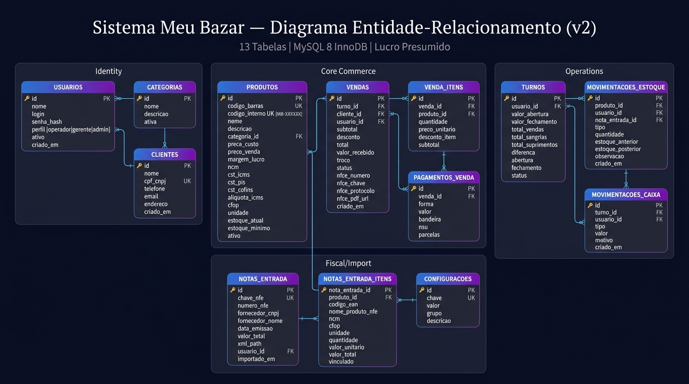

# 🏪 Sistema Meu Bazar

Sistema de gestão completo para bazar físico — **PDV (Frente de Caixa)** + **ERP (Retaguarda)**.

> Sistema white-label: todas as informações da empresa são configuráveis.

---

## 🛠️ Stack Tecnológica

| Componente | Tecnologia |
|---|---|
| Linguagem | Python 3.10+ |
| Interface | PyQt6 |
| Banco de Dados | MySQL 8 (InnoDB) — standalone |
| API Fiscal | Focus NFe (REST/JSON) |
| Build | PyInstaller |
| Plataformas | macOS / Windows |

---

## 📁 Estrutura do Projeto

```
SistemaMeuBazar/
├── main.py                     # Entry point — seletor PDV ou ERP
├── README.md                   # Este arquivo
├── diagrama_er.jpg             # Diagrama do banco de dados
├── requirements.txt            # Dependências Python
├── config/
│   ├── settings.py             # Configurações gerais (DB, paths)
│   └── constants.py            # Constantes fiscais (CST, CFOP, alíquotas)
├── database/
│   ├── connection.py           # Pool de conexões MySQL
│   ├── schema.sql              # DDL completo do banco (13 tabelas)
│   ├── seeds.sql               # Dados iniciais
│   └── setup.py                # Instalador: cria banco, tabelas, seed
├── models/                     # Camada de acesso a dados (DAO)
│   ├── base_model.py           # Classe base com operações genéricas
│   ├── produto.py
│   ├── venda.py
│   ├── cliente.py
│   ├── estoque.py
│   ├── usuario.py
│   ├── caixa.py
│   ├── fiscal.py
│   ├── nota_entrada.py
│   └── configuracao.py
├── services/                   # Lógica de negócios
│   ├── venda_service.py
│   ├── estoque_service.py
│   ├── preco_service.py
│   ├── fiscal_service.py
│   ├── caixa_service.py
│   ├── relatorio_service.py
│   ├── impressao_service.py
│   ├── importacao_nfe.py
│   └── barcode_service.py
├── ui/                         # Interfaces PyQt6
│   ├── themes/
│   │   └── dark_theme.qss
│   ├── components/
│   │   ├── product_search.py
│   │   ├── numeric_keypad.py
│   │   ├── payment_dialog.py
│   │   └── data_table.py
│   ├── pdv/
│   │   ├── pdv_window.py
│   │   ├── cart_widget.py
│   │   ├── turno_widget.py
│   │   └── cupom_widget.py
│   └── erp/
│       ├── erp_window.py
│       ├── produtos_view.py
│       ├── estoque_view.py
│       ├── vendas_view.py
│       ├── clientes_view.py
│       ├── caixa_view.py
│       ├── relatorios_view.py
│       ├── etiquetas_view.py
│       ├── fiscal_view.py
│       ├── importacao_view.py
│       ├── config_view.py
│       └── tef_view.py
├── utils/
│   ├── validators.py
│   ├── formatters.py
│   ├── barcode_gen.py
│   ├── xml_parser.py
│   └── backup.py
├── assets/
│   ├── icons/
│   └── logo/
├── tests/
└── build/
    ├── build_windows.spec
    └── build_macos.spec
```

---

## 🗄️ Diagrama do Banco de Dados

**13 tabelas** | MySQL 8 InnoDB | Regime: Lucro Presumido (CST)



### Tabelas

| # | Tabela | Propósito |
|---|---|---|
| 1 | `usuarios` | Operadores, gerentes e administradores |
| 2 | `categorias` | Agrupamento de produtos |
| 3 | `produtos` | Catálogo com preços, tributação CST, estoque |
| 4 | `clientes` | Cadastro de clientes (CPF/CNPJ) |
| 5 | `turnos` | Controle de abertura/fechamento de caixa |
| 6 | `vendas` | Registro de vendas |
| 7 | `venda_itens` | Itens de cada venda |
| 8 | `pagamentos_venda` | Formas de pagamento (suporta misto + TEF) |
| 9 | `movimentacoes_estoque` | Log de entradas/saídas/ajustes |
| 10 | `movimentacoes_caixa` | Sangrias e suprimentos |
| 11 | `notas_entrada` | NF-e de compra importadas |
| 12 | `notas_entrada_itens` | Itens das NF-e de entrada |
| 13 | `configuracoes` | Parâmetros do sistema (empresa, fiscal) |

---

## 🚀 Instalação

### Pré-requisitos

- **Python 3.10+**
- **MySQL 8** (standalone, sem XAMPP)
  - macOS: `brew install mysql && brew services start mysql`
  - Windows: [MySQL Installer](https://dev.mysql.com/downloads/installer/) (modo "Server Only")

### Setup

```bash
# 1. Clonar/baixar o projeto
cd SistemaMeuBazar

# 2. Criar ambiente virtual
python3 -m venv venv
source venv/bin/activate  # macOS
# venv\Scripts\activate   # Windows

# 3. Instalar dependências
pip install -r requirements.txt

# 4. Configurar banco de dados (primeiro uso)
python -m database.setup

# 5. Executar
python main.py
```

---

## 👥 Perfis de Acesso

| Perfil | PDV | ERP | Configurações |
|---|---|---|---|
| Operador de Caixa | ✅ | ❌ | ❌ |
| Gerente | ✅ | ✅ (parcial) | ❌ |
| Administrador | ✅ | ✅ (total) | ✅ |

---

## 📋 Regime Tributário

- **ME — Lucro Presumido**
- Código fiscal: **CST** (não CSOSN)
- PIS: 0,65% (cumulativo)
- COFINS: 3,00% (cumulativo)
- ICMS: conforme tabela estadual

---

## 📄 Licença

Software proprietário — uso interno.
